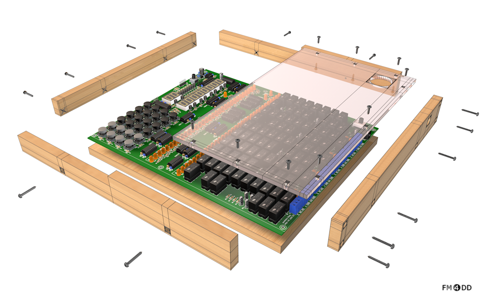

# SBRC Enclosure

This is the design documentation and building plans for a wood enclosure fitting the <a href="http://relaysbc.sourceforge.net/">single board relay computer (SBRC)</a>.

## Details
 * Frame Material: 	12mm quality sina plywood
 * Top Material:	5mm acrylic top cover
 * Feature:		Removable cover for computer control section
 * <a href="./CAD">CAD</a>:		DXF and PDF design documents
 * <a href="./images">images</a>: 	build images
 * <a href="./bom.csv">bom.csv</a>:	materials and parts list

Note: The CAD drawings were used for orders to wood cutting service. To accomodate tolerances in sawing soft wood, parts B,C,D have been given 291 mm instead of 290 mm (required). The final sanding will remove saw marks, and bring those parts down to the exact size.

  

