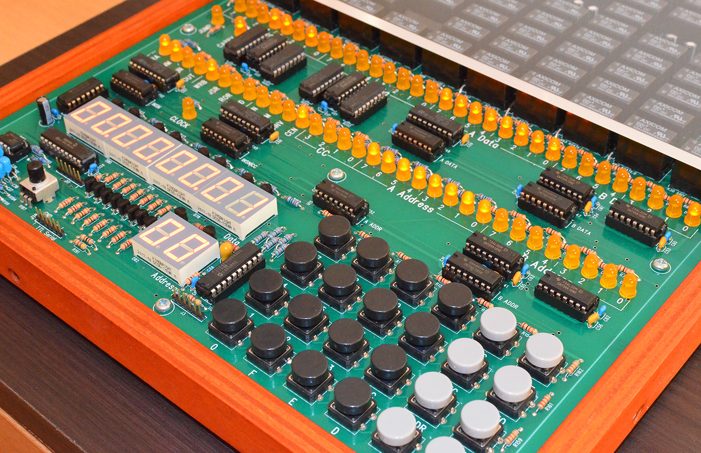

# SBRC Enclosure

This is the design documentation and building plans for a wood enclosure fitting the <a href="http://relaysbc.sourceforge.net/">single board relay computer (SBRC)</a>.

## Details
 * Frame Material: 	12mm quality sina plywood
 * Top Material:	5mm acrylic top cover
 * Feature:		Removable cover for computer control section
 * <a href="./CAD">CAD</a>:		DXF and PDF design documents
 * <a href="./images">Images</a>: 	build images

  

